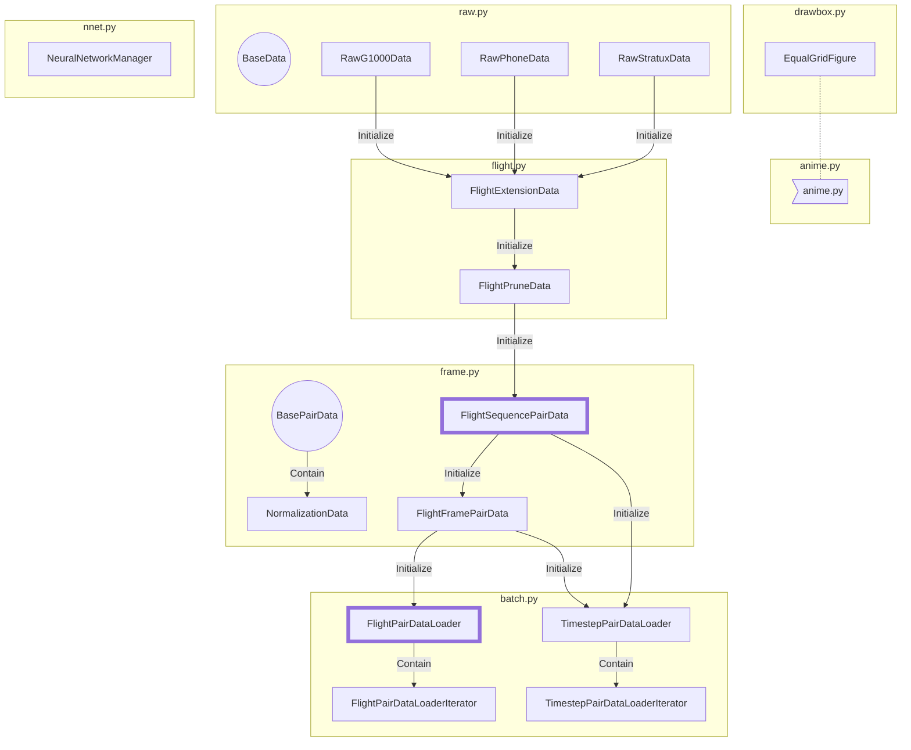

## Classes



## Run

- Data Folder

```
data
	 g1000
	 	020918
	 		Flight 1.xlsx
	 		Flight 2.csv
	 		...
	 	...
	 galaxy
	 	021918
	 		<file>
	 	...
	 pixel
	 	021918
	 		<file>
	 	...
	 stratux
	 	2018_02_09-07_45_27.csv
	 	...
```


- Training and Prediction

```bash
python main.py data output --phone galaxy --update --eval
python main.py output output --phone galaxy --batch-size 16 --model FC3 --win 32 --rate 0.4 --keyword pitch --trig --epochs 100 --lr 0.01 --print-freq 5 --cuda --device 0 --try 1
python main.py output output --phone stratux --batch-size 16 --model LSTM3 --win 32 --rate 0.4 --keyword roll --trig --stratux 1 --epochs 100 --lr 0.01 --print-freq 5 --cuda --device 0 --try 1
python main.py output output --phone galaxy --batch-size 16 --model FC3 --win 1 --offset 1 --keyword hazard --threshold 25 --direct --no-normal --epochs 100 --lr 0.01 --print-freq 5 --cuda --device 0 --try 10
```

- Animation

```bash
python anime.py data galaxy 032618 --start 1000
python test.py output --phone galaxy --model ./model/galaxy
```

If the selected date has several valid flights, it will require you to type flight ID in console (highlight with blue color).

## Risk

- Raw data time zone remains to be a hazard for possible new g1000, phone and stratux data
